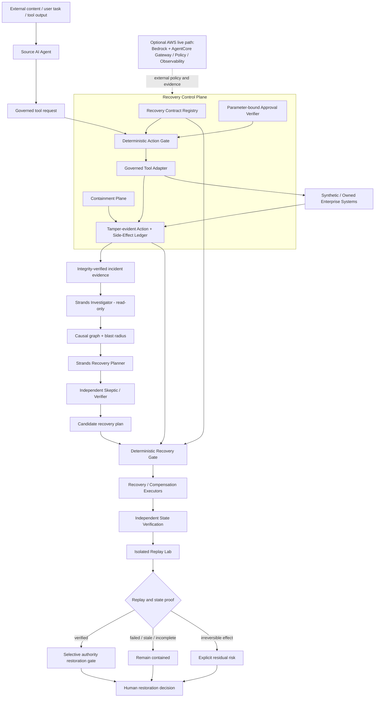

# Agent Recovery Platform Architecture Diagram

This diagram is intended for the Agents for Humans submission and matches the implemented trust boundary.

## Trust boundary

- Strands agents may investigate, hypothesize, challenge and propose.
- Model output never grants approval, executes recovery or restores authority.
- Deterministic gates bind actions to contracts, incident evidence, approvals, dependency order and freshness.
- Irreversible external effects remain visible as residual risk.
- Restoration requires independent state verification plus a fresh replay proof.

## Judge story

`attack -> cross-agent propagation -> blast radius -> scoped containment -> investigation -> recovery planning -> skeptic challenge -> deterministic recovery gate -> dependency-safe recovery -> residual truth -> adversarial replay -> verified selective restoration`
